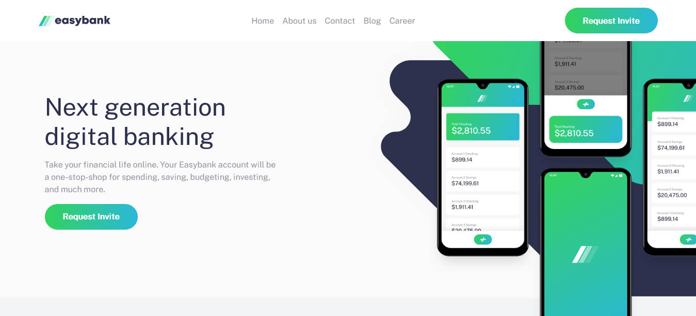

## Table of contents

  

-  [Overview](#overview)

-  [The challenge](#the-challenge)

-  [Screenshot](#screenshot)

-  [Links](#links)

-  [Built with](#built-with)

-  [Useful resources](#useful-resources)

-  [Author](#author)

  
  

### Overview

This is a Frontend Mentor(https://www.frontendmentor.io) coding challenge to help improve front end coding skills by building realistic project.

  
  

### The challenge

Users should be able to:

  

- View the optimal layout for the site depending on their device's screen size

- See hover states for all interactive elements on the page

  

### Screenshot

  

  

### Links

- Solution URL:

- Live Site URL: https://easybankingapp.vercel.app/

### Built with

- HTML5

- CSS

- Flexbox

- Javascript

- Mobile-first workflow

- React- JS library

- CSS Modules - For styles

  
### Useful resources

- [resource 1] https://www.w3schools.com - For quick reference

- [resource 2] https://reactjs.org/docs/ - For quick reference
  
  
## Author

  
- Name - Okose Chidelu Karl

- Instagram - @developerkarl(https://www.instagram.com/developerkarl)

 
